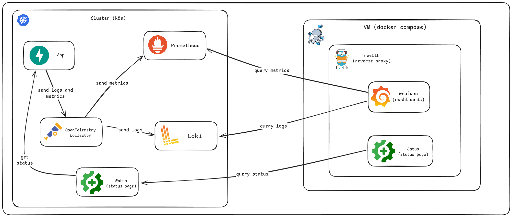

# Observability Stack on GKE

- [Architecture Overview](#architecture-overview)
- [Key Features](#key-features)
  - [Cloud Infrastructure](#cloud-infrastructure)
  - [Observability Tooling](#observability-tooling)
  - [Security & Operations](#security-operations)
- [Resource Configuration](#resource-configuration)
  - [Machine Types](#machine-types)
  - [Disk Sizes](#disk-sizes)
- [Deployed Components](#deployed-components)
  - [Infrastructure Resources](#infrastructure-resources)
  - [Observability Services](#observability-services)
  - [Supporting Platform Services](#supporting-platform-services)
- [Prerequisites](#prerequisites)
  - [Cloud Requirements](#cloud-requirements)
  - [Local Development Environment](#local-development-environment)
  - [Optional Utilities](#optional-utilities)
- [Deployment Instructions](#deployment-instructions)
  - [Initial Setup](#initial-setup)

This repository contains Terraform configurations to deploy a production-ready Google Kubernetes Engine (GKE) cluster with a comprehensive observability stack on Google Cloud Platform.

## Architecture Overview



The infrastructure consists of:

1. **Core Infrastructure**:
   - GKE Cluster with auto-scaling node pools
   - VPC Network with private subnets
   - Compute Engine instances for auxiliary services
2. **Observability Components**:
   - **Metrics**: Prometheus with long-term storage
   - **Logging**: Loki with GCS backend
   - **Visualization**: Grafana dashboards
   - **Uptime Monitoring**: Gatus status pages
3. **Platform Services**:
   - NGINX Ingress Controller
   - cert-manager with Let's Encrypt
   - Automated DNS management

## Key Features

### Cloud Infrastructure

- **GKE Cluster**: Production-grade Kubernetes cluster with:
  - Auto-scaling node pools
  - Workload Identity integration
  - Private cluster networking
- **Networking**: Secure VPC architecture with:
  - Private subnets
  - Cloud NAT for egress traffic
  - Firewall rules for service isolation
- **Compute Resources**: Managed VM instances with:
  - Ubuntu 24.04 LTS
  - SSD persistent disks
  - Automatic DNS registration

### Observability Tooling

- **Metrics**:
  - Prometheus with 15-day retention
  - Custom scrape configurations
  - Alertmanager integration
- **Logging**:
  - Loki with GCS backend storage
  - Log retention policies
  - Multi-tenant support
- **Telemetry**:
  - OpenTelemetry Collector for metrics and logs collection
  - Automatic instrumentation for Python applications
  - OTLP exporter configuration
- **Visualization**:
  - Grafana with pre-configured dashboards
  - SSO integration
- **Status Monitoring**:
  - Gatus with SLA tracking
  - Public status pages

### Security & Operations

- **Ingress**: NGINX with:
  - TLS 1.3 termination
  - Rate limiting
  - IP whitelisting
- **Certificates**: Automated TLS via:
  - cert-manager
  - Let's Encrypt production issuer
  - Wildcard certificate support
- **DNS**: Automated management of:
  - A records
  - CNAME aliases
  - TXT records for DNS-01 challenges

## Resource Configuration

### Machine Types

```hcl
machine_type = {
  default = "e2-standard-2"  # For most workloads
  large   = "e2-standard-4"  # For resource-intensive applications
}
```

### Disk Sizes

```hcl
disk_size = {
  small = 20  # GB - For standard workloads
  large = 50  # GB - For storage-intensive applications
}
```

## Deployed Components

### Infrastructure Resources

- GKE Cluster with node pools
- VPC Network and Subnets
- Compute Engine instances (Ubuntu 24.04 LTS)

### Observability Services

- Prometheus (metrics) at `prometheus.poc-k8s.dados.rio`
- Loki (logs) at `loki.poc-k8s.dados.rio`
- Gatus (status pages) at `gatus.poc-vm.dados.rio`
- Grafana (dashboards) at `grafana.poc-vm.dados.rio`
- OpenTelemetry Collector

### Supporting Platform Services

- NGINX Ingress Controller
- cert-manager with Let's Encrypt integration
- Automated DNS records in `dados-rio` zone

## Prerequisites

### Cloud Requirements

- Google Cloud Platform project with:
  - Billing enabled
  - Following APIs enabled:
    - Kubernetes Engine API
    - Compute Engine API
    - IAM API
    - DNS API
  - DNS Zone Administrator role for `dados-rio` zone
  - Service Account with required permissions

### Local Development Environment

- **Terraform** 1.5+ ([installation guide](https://developer.hashicorp.com/terraform/tutorials/aws-get-started/install-cli))
- **Google Cloud SDK** ([installation guide](https://cloud.google.com/sdk/docs/install))
- **kubectl** ([installation guide](https://kubernetes.io/docs/tasks/tools/))
- **Infisical** account with:
  - Service token with read access
  - Environment profile configured
  - Secrets path properly set

### Optional Utilities

- [just](https://github.com/casey/just) - Command runner for simplified workflows

## Deployment Instructions

### Initial Setup

1. Clone the repository:

   ```bash
   git clone https://github.com/your-org/observability-poc.git
   cd observability-poc
   ```

2. Create a `terraform.tfvars` file with:

   ```hcl
   infisical_address = "your-infisical-host"
   infisical_token   = "your-service-token"  # Should have read access
   infisical_profile = "your-environment"    # e.g., "production"
   infisical_path    = "your/secrets/path"   # Path to secrets
   bucket            = "your-gcs-bucket"     # For Loki storage
   ```

3. Set up your Google Cloud credentials:

   ```bash
   just auth
   ```

4. Initialize Terraform and providers:

   ```bash
   just init
   ```

5. Install helm charts:

   ```bash
   just helm
   ```

6. Review planned changes:

   ```bash
   just plan
   ```

7. Apply the configuration:

   ```bash
   just apply
   ```

> **Note**: Initial certificate provisioning may take up to 5 minutes. Check cert-manager logs if HTTPS access fails.
